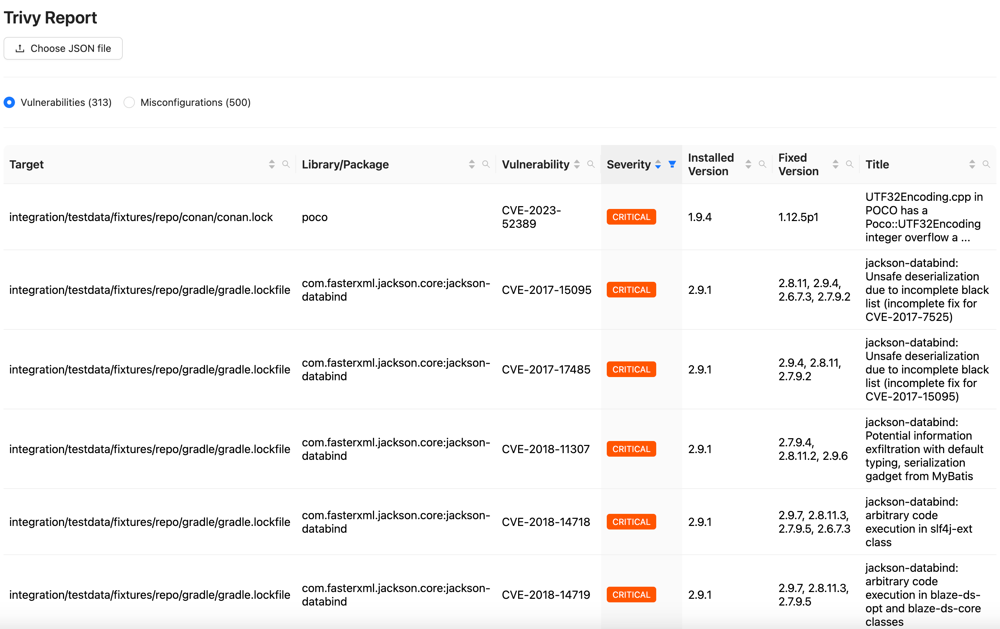
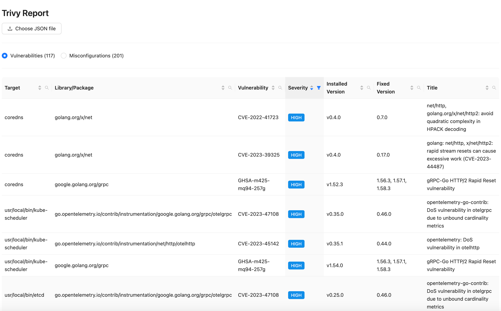
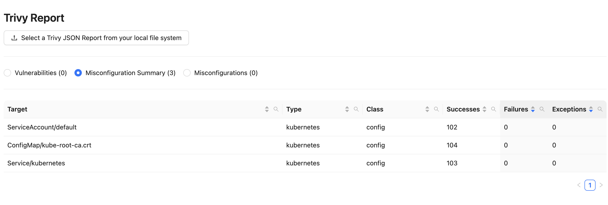
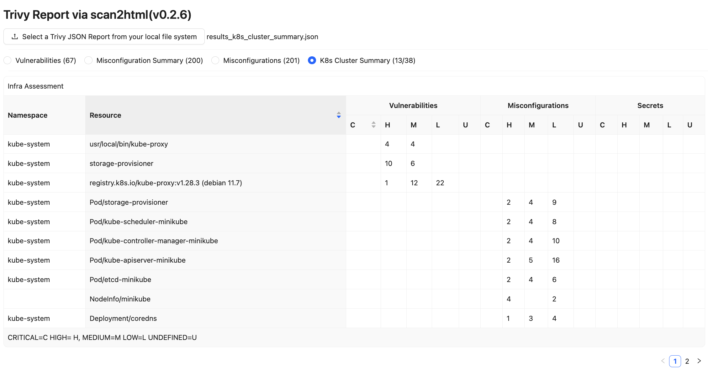

# scan2html 
 


A Trivy plugin that scans and outputs the results to an interactive html file.
## Install
```sh
trivy plugin install github.com/fatihtokus/scan2html
```

## Uninstall
```sh
trivy plugin uninstall scan2html
```

## Usage
### Scan a local folder
```sh
trivy scan2html fs --scanners vuln,secret,misconfig . interactive_result.html
```
<details>
<summary>Result</summary>


</details>

### Scan a k8s cluster
```sh
trivy scan2html k8s cluster interactive_result.html
```
<details>
<summary>Result</summary>


</details>

### Scan a k8s cluster all
```sh
trivy scan2html k8s --report=all all interactive_result.html
```
<details>
<summary>Result</summary>


</details>

### Scan a k8s cluster summary
```sh
trivy scan2html k8s --report summary cluster interactive_result.html
```
<details>
<summary>Result</summary>


</details>

### Scan and generate SBOM(spdx) report
```sh
trivy scan2html image --format spdx alpine:3.15 interactive_result.html
```
<details>
<summary>Result</summary>


</details>

## Help
```sh
$ trivy scan2html -h

Usage: trivy scan2html [-h,--help] command target filename
 A Trivy plugin that scans and outputs the results to an interactive html file.
Options:
  -h, --help    Show usage.
Examples:
   # Scan an image
  trivy scan2html image alpine:latest interactive_result.html

  # Scan a local folder
  trivy scan2html fs --scanners vuln,secret,misconfig . interactive_result.html

  # Scan a k8s cluster
  trivy scan2html k8s cluster interactive_result.html

  # Scan a k8s cluster all
  trivy scan2html k8s --report=all all interactive_result.html

  # Scan a k8s cluster summary
  trivy scan2html k8s --report summary cluster interactive_result.html

  # Scan and generate SBOM(spdx) report
  trivy scan2html image --format spdx alpine:3.15 interactive_result.html
```