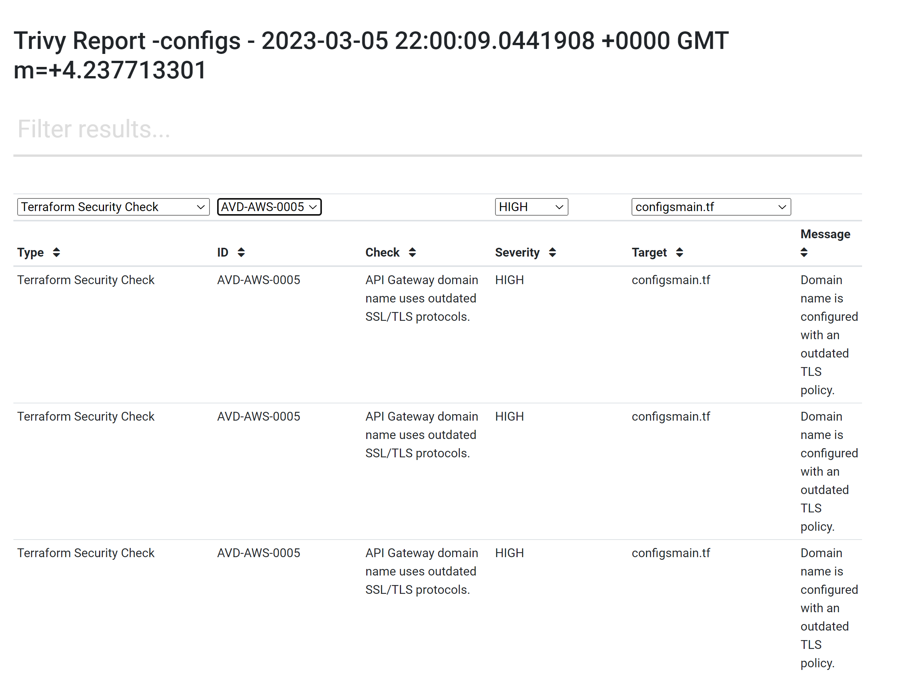

# scan2html
A Trivy plugin that scans and outputs the results to an interactive html file.
## Install
```sh
$ trivy plugin install github.com/fatihtokus/scan2html

$ trivy scan2html -h

Usage: trivy scan2html [-h,--help] command target filename
 A Trivy plugin that scans and outputs the results to an interactive html file.
Options:
  -h, --help    Show usage.
Examples:
  # Scan  image
  trivy scan2html image alpine:latest interactive_result.html

  # Scan a local folder
  trivy scan2html config . interactive_result.html
```
<details>
<summary>Result</summary>



</details>

## Uninstall
```sh
  trivy plugin uninstall scan2html
```
