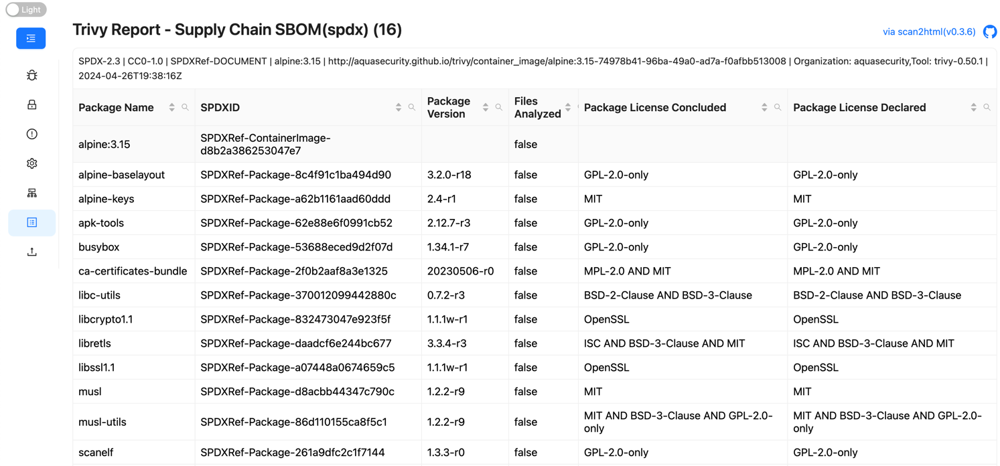

# scan2html 

[](https://scorecard.dev/viewer/?uri=github.com/fatihtokus/scan2html)
[](https://www.bestpractices.dev/projects/9231)

 


Before moving on, please consider giving us a GitHub star ⭐️. Thank you!

## About scan2html
A [Trivy](https://github.com/aquasecurity/trivy) plugin that scans and outputs the results (vulnerabilities, misconfigurations, secrets, SBOM in containers, Kubernetes, code repositories, clouds and more) to an interactive html file.

## Install
```sh
trivy plugin install scan2html
or
trivy plugin install github.com/fatihtokus/scan2html
```

## Uninstall
```sh
trivy plugin uninstall scan2html
```

## Usage
### Generate a report from multiple json scan results - experimental
```sh
trivy scan2html generate interactive_result.html from vulnerabilities.json misconfigs.json secrets.json
```
<details>
<summary>Result</summary>


</details>

### Generate report with EPSS scores from multiple scan results - experimental
```sh
trivy scan2html generate --with-epss interactive_result.html from vulnerabilities.json misconfigs.json secrets.json
```
<details>
<summary>Result</summary>


</details>

### Scan a local folder
```sh
trivy scan2html fs --scanners vuln,secret,misconfig . interactive_report.html
```
<details>
<summary>Result</summary>


</details>

### Scan a k8s cluster
```sh
trivy scan2html k8s cluster interactive_report.html
```
<details>
<summary>Result</summary>


</details>

### Scan a k8s cluster all
```sh
trivy scan2html k8s --report=all interactive_report.html
```
<details>
<summary>Result</summary>


</details>

### Scan a k8s cluster summary
```sh
trivy scan2html k8s --report summary cluster interactive_report.html
```
<details>
<summary>Result</summary>


</details>

### Scan and generate SBOM(spdx) report
```sh
trivy scan2html image --format spdx alpine:3.15 interactive_report.html
```
<details>
<summary>Result</summary>


</details>

## Help
```sh
$ trivy scan2html -h

Usage: trivy scan2html [-h,--help] command target filename
 A Trivy plugin that scans and outputs the results to an interactive html file.
Options:
  -h, --help    Show usage.
Examples:
   # Scan an image
  trivy scan2html image alpine:latest interactive_report.html

  # Scan an image from local tar file
  trivy scan2html image --input ruby-3.1.tar interactive_report.html

  # Scan a local folder
  trivy scan2html fs --scanners vuln,secret,misconfig . interactive_report.html

  # Scan a k8s cluster
  trivy scan2html k8s cluster interactive_report.html

  # Scan a k8s cluster all
  trivy scan2html k8s --report=all all interactive_report.html

  # Scan a k8s cluster summary
  trivy scan2html k8s --report summary cluster interactive_report.html

  # Scan and generate SBOM(spdx) report
  trivy scan2html image --format spdx alpine:3.15 interactive_report.html
  
  # Generate a report from multiple json scan results - experimental
  trivy scan2html generate interactive_result.html from vulnerabilities.json misconfigs.json secrets.json
  
  # Generate report with EPSS scores from multiple scan results - experimental
  trivy scan2html generate --with-epss interactive_result.html from vulnerabilities.json misconfigs.json secrets.json

```
